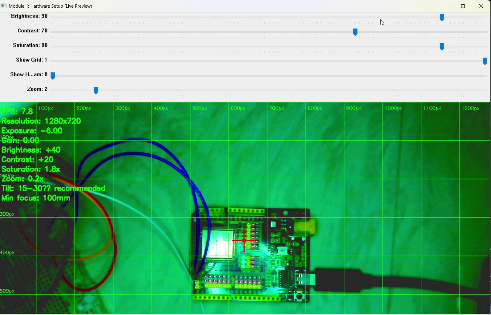
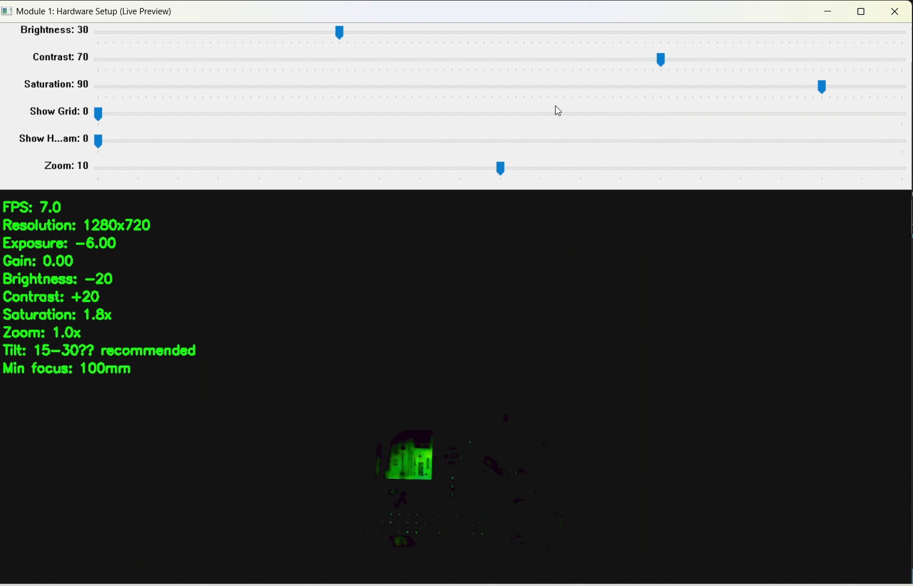
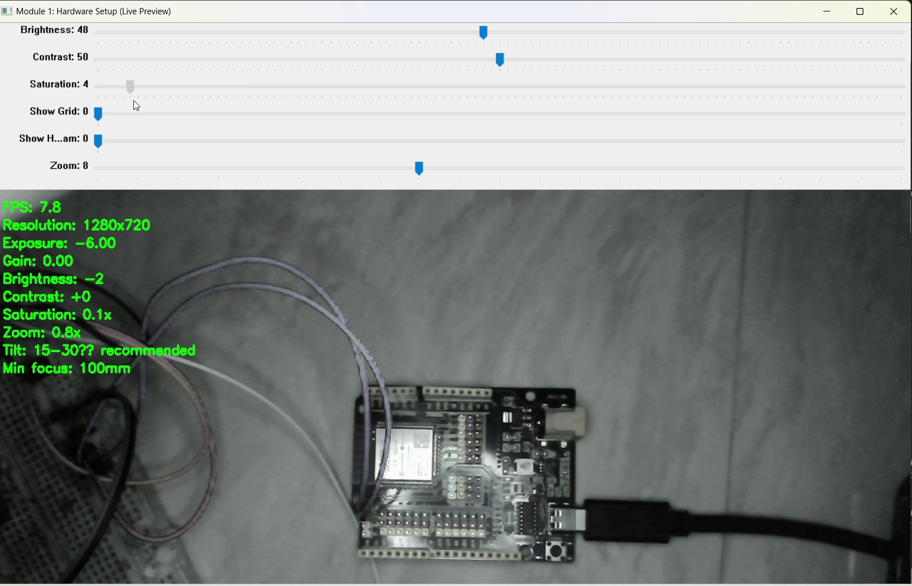

# Module 1 — Camera Acquisition, Conditioning & Diagnostics

Opens the camera, forces it into a fixed manual configuration, and exposes the
conditioning parameters as live sliders alongside four diagnostic views.

`code/module1_hardware_setup.py`

---

## Problem being investigated

Every later module consumes frames from this camera. If acquisition drifts, every
downstream threshold drifts with it, and a tuning session becomes unrepeatable —
values that worked yesterday fail today for reasons invisible in the final result.

The question this module answers: **what is the camera actually delivering, and
which of those properties can I pin down?**

## Design decision — pin the camera, accept the cost

The camera is forced out of every automatic mode at startup:

```python
cap.set(cv2.CAP_PROP_AUTO_EXPOSURE, 0.25)   # manual exposure
cap.set(cv2.CAP_PROP_EXPOSURE, -6.0)
cap.set(cv2.CAP_PROP_GAIN, 0.0)
cap.set(cv2.CAP_PROP_AUTO_WB, 0.0)          # auto white balance off
cap.set(cv2.CAP_PROP_FRAME_WIDTH, 1280)
cap.set(cv2.CAP_PROP_FRAME_HEIGHT, 720)
```

**Rationale:** auto-exposure and auto white balance re-adjust between frames. A
hue value measured under AWB is not a property of the object, it is a property of
that frame. Any threshold tuned against a moving reference has to be re-tuned
constantly. Fixing the camera makes measurements comparable across sessions.

**The cost is visible immediately** and runs through the whole project — see the
observations below.

Backend selection falls back through `CAP_DSHOW → CAP_MSMF → CAP_VFW → CAP_ANY`,
taking the first that opens. Windows exposes the same camera through several
backends with different property support; hardcoding one is a portability trap.

### Every module pins the camera identically, and that is not cosmetic

`initialize_camera()` is byte-identical in all five modules. It was not always.

An audit of the five copies found that **modules 3, 4 and 5 never set
`CAP_PROP_AUTO_WB`** — only modules 1 and 2 did. Their recordings still show the
same green cast, which means those modules were not configuring white balance at
all; they were inheriting it from whichever module had run before them.

Windows camera drivers keep property state between processes. Run module 1, quit,
then run module 3, and module 3 gets manual white balance it never asked for. Run
module 3 first after a reboot and it gets auto white balance instead. Same code,
same camera, different frames — and nothing on screen says which one you have.

That is a reproducibility bug, not a style issue, and it is the sort that produces
"it worked yesterday" with no way to explain why. All five modules now set every
property explicitly, and `tools/check_repo.py` fails the build if any module stops
doing so.

**Design principle: a stage that depends on state it does not set is not
reproducible, even when it appears to work.** Inherited state is invisible
precisely when it is helping you.

---

## Controls

Created in `create_trackbars()` on a separate `Controls` window.

| Slider | Range | Default | Maps to |
|---|---|---|---|
| Brightness | 0–100 | 50 | `beta = value − 50`, applied via `convertScaleAbs` |
| Contrast | 0–100 | 50 | `value − 50`, then a gain/offset pair through `addWeighted` |
| Saturation | 0–100 | 50 | `value / 50` as a multiplier on the HSV S channel |
| Show Grid | 0–1 | 1 | Toggles the grid panel |
| Show Histogram | 0–1 | 0 | Toggles the histogram panel |
| Zoom | 10–20 | 10 | `value / 10`; ≤ 1.0 is a no-op (centre-crop then resize back) |

Keyboard:

| Key | Action |
|---|---|
| `q` | Quit |
| `ESC` | Leave fullscreen |
| `+` / `=` | Raise exposure, clamped at `0` |
| `-` | Lower exposure, clamped at `−13` |

Mouse: click any panel to expand it; click again to return.

## Panels

| Position | Panel | Shows |
|---|---|---|
| Top left | MAIN VIEW | Conditioned frame with FPS, resolution, exposure and slider readout |
| Top right | HISTOGRAM | Per-channel B/G/R curves beneath the frame |
| Bottom left | GRID OVERLAY | 100 px grid with pixel labels and a centre crosshair |
| Bottom right | ZOOM VIEW | Centre crop scaled back to full size |

## Processing flow

```
capture ─▶ brightness/contrast ─▶ HSV saturation scale ─▶ BGR
                                        │
        ┌───────────────┬───────────────┼───────────────┐
     MAIN VIEW      HISTOGRAM      GRID OVERLAY     ZOOM VIEW
    (FPS, res,     (per-channel     (100 px lines,   (centre crop,
     exposure)      B/G/R curves)    centre cross)    resized back)
                                        │
                              composited into one 1600×900 window
```

Conditioning is applied **once**, before the split, so all four panels show the
same conditioned frame.

---

## Observations

### Fixed exposure holds, and clipping is unrecoverable



`Exposure: -6.00`, `Gain: 0.00` hold constant across the entire recording — the
manual configuration is being honoured. The grid overlay labels every 100 px and
marks frame centre, which is what makes the working distance and tilt repeatable
between sessions.

Note `Tilt: 15-30?? recommended`. That is a degree sign in the source string.
`cv2.putText` renders ASCII only, so any non-ASCII character becomes `??`. Small,
but it is the kind of thing that survives into a shipped UI unnoticed.

### Brightness is post-capture arithmetic, not exposure



Brightness at `−20` collapses almost the whole frame to black, leaving only the
brightest region. This is `convertScaleAbs` subtracting a constant from an
already-captured frame — pixels that reach 0 are gone. The `+`/`-` keys drive
`CAP_PROP_EXPOSURE` instead, which changes what the sensor collects.

Two controls that look similar in the UI, doing fundamentally different things.
Worth separating in your head before tuning anything downstream.

### The green cast, and why removing it is not a fix



Every frame carries a heavy green cast, the direct result of `CAP_PROP_AUTO_WB, 0.0`.
Dropping saturation to `0.1x` produces a clean neutral image — same exposure, same
gain, same scene.

That comparison isolates the problem: **luminance is fine, chroma is wrong.**

It also shows why the fix is not a fix. Saturation scaling suppresses the cast by
discarding chroma. Module 2 works in hue space and needs chroma to survive. So the
cast cannot be hidden here — it has to be dealt with as a white-balance problem,
or accepted and measured. Module 2 documents what happens when it is accepted.

### Throughput

The overlay reports `7.0`–`7.8` FPS at 1280×720, against `CAP_PROP_FPS` requested
at 30. The gap is not investigated in this module.

Two caveats: the reported value is instantaneous (`1 / Δt` between iterations, no
smoothing), and it comes from the earlier single-view build. The current
four-panel build performs four extra resizes and a composite per frame, and **has
not been measured.**

---

## Bug found: histogram crashed under numpy 2.x

`cv2.calcHist` returns shape `(256, 1)`, so `hist[j]` is a one-element array.
numpy ≥ 2.0 refuses to coerce that to `int`:

```
TypeError: only 0-dimensional arrays can be converted to Python scalars
```

Because `Show Histogram` defaults to `0`, the crash only fired when the toggle was
switched on. Fixed by flattening to a `(256,)` vector after normalisation.

Found by `tools/verify_modules.py` against a synthetic frame — no camera involved.
A latent crash on a default-off code path is exactly what a hardware-dependent
manual test misses.

---

## Limitations

- `exposure` and `gain` are read **once in `main()` before the frame loop**. The
  `Gain: 0.00` readout is a startup snapshot, not live. Exposure stays correct
  only because the `+`/`-` handlers update the local variable.
- FPS is instantaneous and unsmoothed, so the figure jitters frame to frame.
- Saturation scaling round-trips BGR → HSV → BGR every frame at full resolution.
- Zoom is a centre crop resized back up. It adds no detail; it enlarges pixels.
- No way to persist a tuned configuration. Values are re-entered each run.

## Evidence

Stills in `images/` are extracted from `vedios/module_1_1.mp4`.

**Version note:** the module 1 recordings predate a layout refactor and show an
earlier single-view build with the trackbars attached to the preview window. The
parameter maths are identical — slider 90 → `Saturation: 1.8x`, slider 30 →
`Brightness: -20`, matching `value − 50` and `value / 50` in the current source.
What changed is the panel arrangement and two overlay lines. No behavioural
difference in the conditioning path.

## Running it

```bash
pip install -r ../requirements.txt
python code/module1_hardware_setup.py
```

Requires a camera at device index 0. To check the processing functions without
hardware:

```bash
python ../tools/verify_modules.py
```

## Next

[Module 2 — HSV Segmentation](../module-02-hsv-segmentation/) takes these
conditioned frames and tries to isolate an LED by colour. The green cast
documented above turns out to matter more than any slider in that module.
