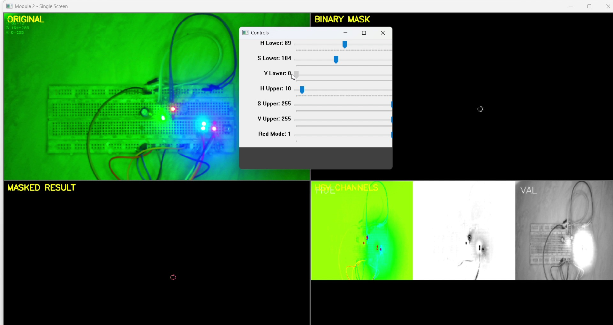

# Module 2 — Digital Colour Mastery (HSV)

Converts the conditioned frame to HSV, builds a binary mask from live threshold
sliders, and shows the mask, the masked result, and the separated H/S/V channels
side by side.

`code/module2_hsv_color_mastery.py`

---

## Problem being investigated

Isolate a red LED from everything else in frame, using colour alone.

The naive approach — threshold on BGR — fails because in BGR a "red" pixel's three
channel values all shift together when illumination changes. Brightness and colour
are entangled, so a threshold tuned at one light level breaks at another.

HSV separates them: **H** carries colour, **S** carries how much colour, **V**
carries brightness. Threshold hue for identity, saturation to reject greys, value
to reject shadows. Three axes with distinct meanings instead of three correlated ones.

## Design decision — dual-range red

Red is the one colour that cannot be expressed as a single hue window. OpenCV maps
hue to 0–179, and red sits at both ends: it wraps through 0. A window like
`[0, 10]` catches one half and silently discards the other.

`Red Mode` builds two masks and ORs them:

```python
mask1 = cv2.inRange(hsv, [0,   s_lower, v_lower], [10,  s_upper, v_upper])
mask2 = cv2.inRange(hsv, [170, s_lower, v_lower], [179, s_upper, v_upper])
mask  = cv2.bitwise_or(mask1, mask2)
```

**Rationale:** a hue band should be set by where the target actually lands, with
margin — not by a textbook value. Auto-exposure and white-balance drift move a
colour's *measured* hue between frames, so a band fitted tightly around one sample
will drop frames. Width is what buys stability.

---

## Controls

| Slider | Range | Default | Effect |
|---|---|---|---|
| H Lower | 0–179 | 0 | Lower hue bound — **ignored when Red Mode is on** |
| S Lower | 0–255 | 120 | Rejects washed-out and grey pixels |
| V Lower | 0–255 | 80 | Rejects shadow |
| H Upper | 0–179 | 10 | Upper hue bound — **ignored when Red Mode is on** |
| S Upper | 0–255 | 255 | Rarely moved from maximum |
| V Upper | 0–255 | 255 | Lower it to reject blown highlights |
| Red Mode | 0–1 | 1 | 1 = dual-range red, 0 = single H window |

| Key | Action |
|---|---|
| `q` | Quit |
| `ESC` | Leave fullscreen |
| `s` | **Print** current bounds to the console |

`s` prints. It does not write a file — the tuned values must be copied by hand.

## Panels

| Position | Panel | Shows |
|---|---|---|
| Top left | ORIGINAL | Conditioned frame with the active bounds overlaid |
| Top right | BINARY MASK | `cv2.inRange` output — the tuning reference |
| Bottom left | MASKED RESULT | `bitwise_and(frame, frame, mask=mask)` |
| Bottom right | HSV CHANNELS | H (colour-mapped), S, V as greyscale |

---

## Observations

### The mask stays empty, and the sliders are not the reason



`H Lower` has been dragged to **89** — most of the way across the hue range. The
overlay updates to `H 89-10`. The binary mask is completely black. So is the
masked result.

Two separate problems are visible in this one frame.

### Problem 1 — the LED has no colour left to threshold

Sampling HSV directly from the captured frame:

| Region | H | S | V |
|---|---:|---:|---:|
| Red LED core | 33 | **11** | 255 |
| Red LED core | 146 | **6** | 255 |
| Cyan/blue LED | 90 | 147 | 254 |
| Background | 59 | **246** | 189 |
| Breadboard body | 59 | **247** | 203 |

The LEDs are clipped: `V = 255` with `S` in single digits. At that saturation the
hue reading is noise — 33 and 146 are not "reddish", they are what you get when
you ask for the hue of a white pixel. No saturation threshold can recover it,
because there is no chroma to threshold.

Meanwhile the background sits at `S = 246`. **The most saturated object in the
frame is the wall behind the target.**

That inverts the assumption the whole approach rests on. HSV thresholding expects
a saturated target against a neutral background. Here it is a neutral target
against a saturated background — a direct consequence of the disabled auto white
balance from [module 1](../module-01-camera-conditioning/), combined with an
exposure that clips the LEDs.

This is why the mask stays empty here, and it propagates: modules 3 and 4 inherit
the same empty mask.

> Measured from a JPEG-compressed screen recording rather than raw sensor frames,
> so treat the numbers as indicative. `S = 11` against `S = 246` is far beyond
> compression error.

### Problem 2 — a control that does nothing

With Red Mode on, `apply_hsv_mask()` uses hardcoded bands `[0,10]` and `[170,179]`.
`h_lower` and `h_upper` are never read. But the overlay still prints `H 89-10`,
as though the slider were driving the mask.

So the frame above shows a slider moved a long way, a readout confirming the
change, and no effect whatsoever.

Confirmed programmatically in `tools/verify_modules.py`:

```python
# Red Mode on: shifting the H sliders produces a byte-identical mask
assert np.array_equal(
    apply_hsv_mask(hsv, dict(bounds, h_lower=90, h_upper=130)),
    apply_hsv_mask(hsv, bounds))
```

**Design principle: a control that appears to work but is ignored is worse than no
control at all.** A missing slider is a known limitation. A dormant one sends you
hunting for a lighting or camera fault that does not exist, and once someone
discovers one control is fake, they stop trusting the rest of the panel.

Left in place deliberately, documented rather than patched, because the failure it
produces is the point. The honest fix is either to make Red Mode centre its bands
on `h_lower`/`h_upper`, or to grey the sliders out when it is on.

### Channel separation makes the diagnosis quick

The HSV CHANNELS panel is what turns this from guesswork into a five-second read.
The SAT channel is near-white across the background and dark at the LEDs —
saturation is inverted relative to the target. The VAL channel shows the LEDs as
solid white blobs, confirming the clipping. The HUE channel is a flat green field.

Splitting the channels answers *which axis is wrong* before any slider is touched.

---

## Engineering insight

**Tuning cannot fix an acquisition problem.** Every slider in this module operates
downstream of a frame in which the target's colour information has already been
destroyed by clipping. The full range of every control was explored, and the mask
stayed black, because the failure is upstream.

The correct fix sequence runs backwards through the pipeline: lower exposure until
the LED cores stop clipping and `S` recovers, address white balance so background
chroma drops, and only then tune hue bands.

Building the pipeline in isolated, observable stages is what made this visible.
A single end-to-end script would have shown "no detections" and left the cause
buried.

## Limitations

- Hue bands are hardcoded when Red Mode is on; the H sliders are inert (above).
- `s` prints to the console and nothing else. `saved_bounds` is assigned and never
  read again.
- Only red has a wrap-around mode. Any other wrapping range needs a code change.
- The HSV CHANNELS panel renders each channel at 200×200 before upscaling to the
  panel slot, so it is heavily degraded — usable for judging *character*, not detail.
- No morphological cleanup here; that is [module 3](../module-03-preprocessing/).
- Bounds do not carry forward. Modules 3–5 hold their own copies in source
  (module 3 at line 146; modules 4 and 5 inside their preprocess functions).

## Evidence

Stills in `images/` are extracted from `vedios/module_2.mp4`, which was recorded
against the current source.

## Running it

```bash
pip install -r ../requirements.txt
python code/module2_hsv_color_mastery.py
```

## Next

[Module 3 — Preprocessing](../module-03-preprocessing/) applies blur, erosion and
dilation to the mask. It inherits the near-empty mask documented here, which turns
out to make the morphology behave in an instructive way.
