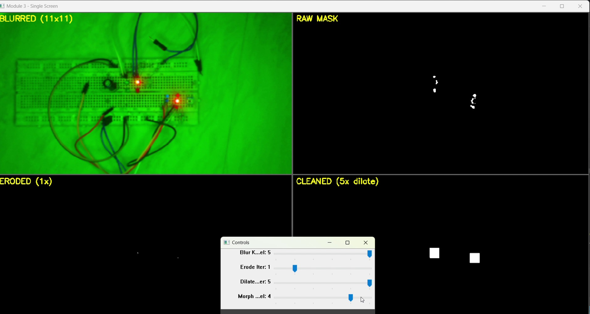

# Module 3 — Preprocessing & Cleaning

Takes the HSV mask and applies blur, erosion and dilation, showing the mask at
each stage so the effect of every operation is visible rather than inferred.

`code/module3_preprocessing_cleaning.py`

---

## Problem being investigated

A raw `inRange` mask is never clean. It carries isolated bright pixels from sensor
noise, ragged edges, and holes where the target's own highlights fell outside the
threshold. Feeding that directly into contour detection produces dozens of
one-pixel contours and a target broken into fragments.

The question: **which morphological sequence turns a noisy mask into one solid
blob, without destroying the target?**

## Design decision — separate erode and dilate rather than open/close

`cv2.morphologyEx` offers `MORPH_OPEN` (erode then dilate) and `MORPH_CLOSE`
(dilate then erode) as single calls. This module applies erosion and dilation as
independent, separately-controlled steps instead.

**Rationale:** an opening with one kernel forces erode and dilate to use the same
iteration count. Separating them lets erosion and dilation be tuned against each
other — erode 2, dilate 3 nets a slightly grown blob; erode 2, dilate 1 nets a
shrunken one. That asymmetry is the useful part, and it is what the panels are
there to expose. The cost is two trackbars instead of one.

---

## Controls

| Slider | Range | Default | Effect |
|---|---|---|---|
| Blur Kernel | 0–5 | 1 | Gaussian kernel size, computed as `2n + 1` (so 1 → 3×3, 5 → 11×11) |
| Erode Iter | 0–5 | 1 | Erosion passes. 0 disables erosion. |
| Dilate Iter | 0–5 | 1 | Dilation passes. 0 disables dilation. |
| Morph Kernel | 0–5 | 1 | Structuring element size, also `2n + 1` |

Both size sliders map through `2n + 1` because OpenCV kernels must be odd. The
slider value is *not* the kernel size — slider 2 is a 5×5 kernel.

| Key | Action |
|---|---|
| `q` | Quit |
| `ESC` | Leave fullscreen |
| `r` | Reset all sliders to defaults |

## Panels

| Position | Panel | Shows |
|---|---|---|
| Top left | BLURRED (NxN) | Frame after Gaussian blur, kernel size in the label |
| Top right | RAW MASK | `inRange` output before any morphology |
| Bottom left | ERODED (Nx) | After erosion, iteration count in the label |
| Bottom right | CLEANED (Nx dilate) | After dilation — the mask passed downstream |

## Processing flow

```
frame ─▶ GaussianBlur ─▶ BGR2HSV ─▶ inRange ─▶ erode ─▶ dilate
                                       │          │        │
                                   RAW MASK    ERODED   CLEANED
```

Blur is applied to the **colour frame before conversion**, not to the mask. This
is deliberate: smoothing the image suppresses the sensor noise that would
otherwise produce isolated mask pixels in the first place. Blurring a binary mask
afterwards would only soften edges that are already committed.

Panel labels carry the live parameter values — `ERODED (2x)`, `CLEANED (1x dilate)`,
`BLURRED (5x5)` — so a screenshot records the settings that produced it.

---

## Observations

### Dilation on a starved mask manufactures shapes



This module inherits the near-empty mask documented in
[module 2](../module-02-hsv-segmentation/). The RAW MASK panel holds a handful of
scattered pixels — not the LED, which is clipped to white and carries no chroma.

Raising dilation does not recover the LED. It grows the surviving noise pixels
into solid squares, roughly the size of the structuring element. The CLEANED panel
fills with blocky artifacts that look like detections and are not.

**This is the failure mode worth internalising.** Morphology has no concept of
what the target is. Dilation grows whatever it is given. On a healthy mask that
closes holes; on a starved mask it fabricates plausible-looking blobs out of
noise, and every downstream stage treats them as real.

A cleaned mask is not evidence of a correct mask.

### Erosion first is what makes dilation safe

The ordering matters and the panels show why. Erosion removes any structure
smaller than the kernel — genuine single-pixel noise disappears entirely. Only
what survives gets grown back.

With `Erode Iter` at 0, dilation acts on the unfiltered mask and the artifacts
above appear immediately. With erosion at 1–2 first, most isolated pixels are gone
before dilation runs.

That ordering is exactly an opening. Splitting it into two sliders is what makes
the intermediate state visible.

### Blur trades noise against small targets

Larger blur kernels reduce the noise reaching `inRange`, but a Gaussian averages a
small bright target with its darker surroundings. A distant LED spanning a few
pixels loses enough value and saturation under an 11×11 kernel to fall outside the
threshold that caught it at 3×3.

Under this setup the mask is empty either way, so no useful trade-off point could
be established. Recorded as a constraint to test once acquisition is corrected.

---

## Engineering insight

**Cleaning operations are irreversible and unaccountable.** Every stage in this
module discards information, and none of them report what they removed. Erosion
deletes small structures without distinguishing noise from a distant target.
Dilation invents area without knowing whether the seed was real.

The staged panels are the mitigation. Seeing RAW MASK next to CLEANED makes the
difference between them explicit, and that difference is where the honest answer
lives. A pipeline that only shows the final mask gives you no way to tell a
successful cleanup from a fabricated one.

The general form: when a stage cannot justify its own output, show its input
beside it.

## Limitations

- HSV bounds are **hardcoded** in `main()` and there is no trackbar for them. A
  value tuned in module 2 has to be copied into the source by hand.
- Blur, erode and dilate all use the same square structuring element. Non-square
  or elliptical kernels would suit elongated targets better.
- `create_diff_visualization()` computes what erosion removed and what dilation
  added, but the diff panel is not part of the default 2×2 layout.
- No connected-component count, so there is no numeric signal that the mask
  fragmented — it has to be judged by eye.
- Blur is applied before HSV conversion, so its cost scales with full colour
  resolution rather than the single-channel mask.

## Evidence

Stills in `images/` are extracted from `vedios/module_3.mp4`, recorded in May 2026.
The source has since been tidied without changing on-screen behaviour.

## Running it

```bash
pip install -r ../requirements.txt
python code/module3_preprocessing_cleaning.py
```

## Next

[Module 4 — Pattern Detection](../module-04-pattern-detection/) takes the cleaned
mask and looks for shapes. It also runs a second, independent detector that does
not use the mask at all — and the contrast between the two is the sharpest result
in this project.
