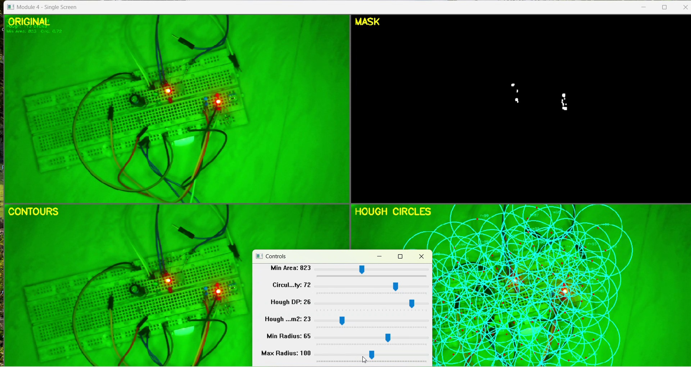

# Module 4 — Pattern Detection & Shape Analysis

Runs two independent circle detectors on the same frame — contour analysis with a
circularity filter, and Hough circle transform — and displays both side by side.

`code/module4_pattern_detection.py`

---

## Problem being investigated

The mask says *where colour matched*. It does not say whether that region is the
round LED being looked for or an arbitrary blob of the right hue.

Two established approaches exist, and they take completely different routes:

- **Contours + circularity** — find connected regions in the binary mask, measure
  how round each one is, keep the round ones.
- **Hough circle transform** — vote for circle centres directly from image
  gradients, independent of any mask.

Rather than pick one, this module runs both and shows them together. The question
being investigated is which is appropriate here, and why.

## Design decision — circularity as a shape metric

```python
circularity = (4 * math.pi * area) / (perimeter ** 2)
```

This is the isoperimetric quotient: 1.0 for a perfect circle, lower for anything
else. A square is about 0.785; a ragged blob is far lower.

**Rationale:** it is scale-invariant. An LED at 20 cm and the same LED at 100 cm
have very different areas but the same circularity, so one threshold covers the
working range. Area alone cannot do that — it would need re-tuning at every
distance.

**Where it breaks:** perimeter is measured along the contour's pixel path, so a
noisy edge inflates it. Since perimeter is squared in the denominator, a jagged
outline pushes circularity down hard. Small contours suffer most — a 10-pixel blob
has a perimeter dominated by pixel stair-stepping. This is why
[module 3](../module-03-preprocessing/) matters: circularity is only meaningful on
a smooth mask.

Contours are scored `area × circularity` so the largest *and* roundest candidate
wins, rather than the merely largest.

---

## Controls

| Slider | Range | Default | Effect |
|---|---|---|---|
| Min Area | 0–2000 | 200 | Rejects contours below this pixel area |
| Circularity | 0–100 | 60 | Divided by 100 → threshold of 0.60 |
| Hough DP | 0–30 | 12 | Divided by 10 → accumulator resolution of 1.2 |
| Hough Param2 | 0–100 | 25 | Centre-detection threshold. Lower finds more circles. |
| Min Radius | 0–100 | 5 | Smallest circle accepted, pixels |
| Max Radius | 0–200 | 100 | Largest circle accepted, pixels |

`param1` (the Canny threshold, fixed at 100) and `minDist` (fixed at 50) are
**hardcoded** and have no sliders.

Contours are drawn green when they pass the circularity threshold and red when
they fail, each annotated with its measured value — so rejected candidates stay
visible with the reason attached.

## Processing flow

```
frame ─┬─▶ blur ─▶ HSV ─▶ inRange ─▶ erode ─▶ dilate ─▶ findContours ─▶ CONTOURS
       │                                                  + circularity
       │
       └─▶ grayscale ──────────────────────────────────▶ HoughCircles ─▶ HOUGH
```

**The two paths share no input.** Contours read the HSV mask; Hough reads plain
grayscale and never sees the mask. That is the single most important fact about
this module.

---

## Observations

### One frame, two opposite failures



Same frame, same instant:

- **CONTOURS finds nothing.** The mask is near-empty, inherited from
  [module 2](../module-02-hsv-segmentation/), so there is nothing to contour.
- **HOUGH finds hundreds of circles**, blanketing the breadboard in overlapping
  rings.

Both detectors are working exactly as designed. The inputs are what differ.

### Why Hough over-detects here

A breadboard is a dense, regular grid of small dark holes. Every hole is a
near-perfect circular gradient at roughly the same radius — which is the precise
signal `HoughCircles` is built to accumulate votes for.

This is close to a worst case for circle detection: a periodic array of
circle-like features filling the frame. Radius bounds cannot help, because the
holes fall inside the same 5–100 px window as the LED. `minDist` is hardcoded at
50, which limits clustering but not the count across a full frame.

Raising `Param2` suppresses weak candidates, but the holes are not weak — they are
strong, well-formed circular gradients. The threshold that finally rejects them
also rejects the LED.

**The background is not noise this detector can be tuned past. It is the same
class of feature as the target.**

### Why contours under-detect here

Nothing to do with shape analysis. The mask arrives empty because the LED is
clipped to white with `S ≈ 11` — measured in
[module 2](../module-02-hsv-segmentation/). `findContours` on an empty mask
returns an empty list. Circularity is never reached.

### What this actually establishes

Running both detectors on one frame separates two questions that look alike:

| | Contours | Hough |
|---|---|---|
| Input | HSV mask | Grayscale |
| Failure here | Finds nothing | Finds everything |
| Root cause | Upstream acquisition | Wrong detector for this background |
| Fixed by tuning? | No | No |

Neither failure is a parameter problem, and a single-detector pipeline would have
produced one symptom with no way to tell which kind it was. Contours alone would
have said "no detections" and sent you tuning circularity. Hough alone would have
said "hundreds of detections" and sent you raising Param2. Both roads lead nowhere.

---

## Engineering insight

**Choose a detector by what distinguishes the target from its background, not by
what the target is.**

The LED is round, so a circle detector seems like the obvious tool. But on a
breadboard, roundness is the most common property in the frame — it carries no
discriminating information at all. Colour and brightness do distinguish the LED,
once acquisition stops destroying them.

Hough is the right tool when circles are rare in the scene. Here they are
everywhere, so it degenerates into an edge detector with extra steps.

The corollary: **two detectors disagreeing is more informative than either
agreeing with itself.** Contradiction localises the fault. Confirmation does not.

## Limitations

- HSV bounds are hardcoded inside `preprocess_for_detection()`; no slider reaches
  them.
- `minDist=50` and `param1=100` are hardcoded at `module4_pattern_detection.py:107`-108.
- The two paths cannot be cross-checked in code — no logic compares a Hough circle
  against a contour, so agreement between them is judged by eye.
- Circularity is unreliable below roughly 50 px of area, where pixel
  stair-stepping dominates the perimeter.
- Hough runs on every frame at full resolution regardless of whether the mask has
  any content, which is the dominant per-frame cost.
- No detection count is displayed, so "hundreds of circles" is an observation from
  the panel rather than a logged number.

## Evidence

Stills in `images/` are extracted from `vedios/module_4.mp4`, recorded against the
current source.

## Running it

```bash
pip install -r ../requirements.txt
python code/module4_pattern_detection.py
```

## Next

[Module 5 — Robotics Logic](../module-05-robotics-logic/) takes detections and
turns them into decisions, which raises a different problem: a detector that is
right most of the time still produces a robot that behaves erratically.
