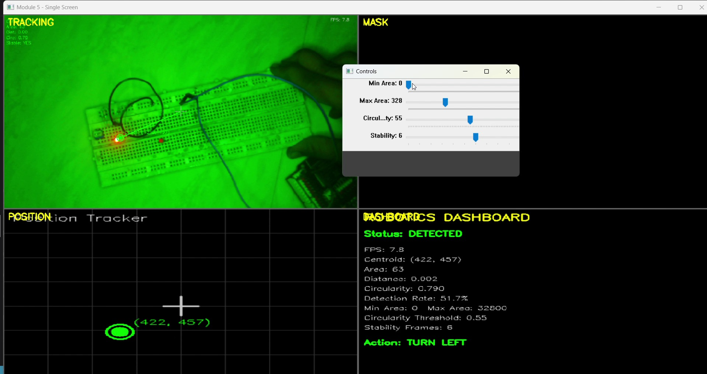

# Module 5 — Robotics Implementation & Logic

Wraps detection in a stateful tracker: area and shape gates, a stability window,
position history, and a decision layer that emits a movement command.

`code/module5_robotics_logic.py`

---

## Problem being investigated

Modules 1–4 answer *is there an LED in this frame*. That question is answered
independently every frame, and its answer flickers — a marginal contour passes at
frame 100, fails at 101, passes at 102.

A detector that is right 95% of the time is not a robot that moves correctly 95%
of the time. Feed per-frame detections straight into motor commands and the robot
oscillates on every dropped frame.

The question: **what has to sit between a detection and an actuator?**

## Design decision — a stability window, not a per-frame decision

`LEDTracker` keeps a sliding window of recent detection outcomes:

```python
self.detection_history.append(True)
if len(self.detection_history) > self.stability_frames:
    self.detection_history.pop(0)
stable = all(self.detection_history) and len(self.detection_history) >= self.stability_frames
```

A detection is only `stable` when the window is full and every frame in it
succeeded. Commands are gated on `stable`, not on `detected`.

**Rationale:** the underlying signal is stochastic. Thresholds sit near
boundaries, contour area jitters by a few pixels, and single frames fail for
reasons that have nothing to do with the target moving. Requiring N consecutive
successes converts a noisy binary signal into a slower, quieter one — the cost
paid deliberately, in latency, for not acting on noise.

## Design decision — score by area × circularity

```python
score = area * circ
```

**Rationale:** largest-wins picks up a big irregular reflection over a small clean
LED. Roundest-wins picks up a tiny perfectly-round noise speck over the real
target. The product requires a candidate to be both, and one dimension cannot
fully compensate for the other.

---

## Controls

| Slider | Range | Default | Effect |
|---|---|---|---|
| Min Area | 0–2000 | 200 | Rejects contours below this pixel area |
| Max Area | 0–1000 | 500 | Multiplied by 100 → 50,000 px ceiling |
| Circularity | 0–100 | 60 | Divided by 100 → threshold of 0.60 |
| Stability | 0–10 | 3 | Consecutive good frames required before acting |

`Max Area` is scaled by 100 because OpenCV trackbars are integer-valued and a
0–50,000 slider would have unusable resolution.

## Panels

| Position | Panel | Shows |
|---|---|---|
| Top left | TRACKING | Frame with contour, centroid and live FPS |
| Top right | MASK | The binary mask driving everything |
| Bottom left | POSITION | Centroid plotted on a crosshair grid with coordinates |
| Bottom right | DASHBOARD | Status, metrics, thresholds, and the emitted action |

A DISTANCE panel also exists and is reachable only by fullscreen selection; it is
not part of the default 2×2 layout.

## Decision layer

```python
if data["stable"] and data["centroid"]:
    cx = data["centroid"][0]
    if abs(cx - 640) < 50:   action = "MOVE FORWARD"
    elif cx < 640:           action = "TURN LEFT"
    else:                    action = "TURN RIGHT"
else:                        action = "SEARCH"
```

A ±50 px deadband around frame centre. Without it, a centroid sitting near the
midpoint would alternate TURN LEFT and TURN RIGHT every frame — the same
oscillation the stability window prevents in time, applied in space.

---

## Observations

### The three-state progression is the module working



The dashboard moves through three states, visible across the recording:

| State | Colour | Meaning |
|---|---|---|
| `NOT DETECTED` | red | No contour passed the gates |
| `DETECTED (UNSTABLE)` | orange | Contour found, window not yet full |
| `DETECTED` | green | Window full and unbroken |

`Action:` stays `SEARCH` through the first two and only switches to a movement
command in the third. The orange intermediate state is the useful part — it
distinguishes *nothing there* from *something there that I do not trust yet*. A
two-state display would collapse those into one and hide the latency the stability
window is deliberately introducing.

Once stable, `Action:` tracks the target through `TURN RIGHT`, `TURN LEFT` and
`MOVE FORWARD` as the centroid crosses the deadband.

### "Distance" is a normalised area ratio, not a distance

```python
def estimate_distance(self, area):
    return min(area / self.max_area, 1.0)
```

The dashboard prints `Distance: 0.845`. That figure is contour area divided by the
`Max Area` slider, clamped to 1.0. It is unitless, it moves when the slider moves,
and it has never been calibrated against a measured physical distance.

It is a usable *relative proximity* signal — bigger blob, closer target, all else
equal. It is not a measurement, and the dashboard label overstates it.
`Proximity (relative)` would be the honest label. Recorded here rather than
silently corrected, because the label is what shipped in the recording.

### Detection rate is cumulative, not recent

`detection_rate = detection_count / total_frames` counts from program start and is
never windowed. Ten minutes in, the figure is dominated by history and barely
responds to what is happening now. A recovered pipeline would take a long time to
show a healthy rate.

A rolling window over the last N frames would make it a live health indicator
instead of a lifetime average.

---

## Engineering insight

**A perception stage should hand over confidence, not just an answer.**

Modules 1–4 emit a per-frame boolean. That is not enough to act on, because it
carries no indication of how much to trust it. This module adds the missing part
in the simplest form that works: N consecutive agreements before anything moves.

Two related design notes fall out of building it.

**Where the deadband goes.** Both the stability window and the ±50 px deadband
solve the same problem — a decision boundary that noise can straddle. One applies
hysteresis in time, the other in space. Any threshold that drives an actuator
needs one or the other, or it will chatter at the boundary.

**Hard reset versus soft decay.** As written, `all(self.detection_history)` means
a single failed frame anywhere in the window blocks `stable`. One glitch costs the
full re-accumulation. A counter that decrements on failure instead of resetting to
zero would keep accumulated confidence while still walking back down under
sustained failure — the same protection against noise, without discarding good
history on one bad frame. The current behaviour is the strict version; the
trade-off is responsiveness after transients.

## Limitations

- HSV bounds are hardcoded inside `preprocess_frame()` with no slider.
- Frame centre is hardcoded as `640`. Correct at 1280 wide; wrong at any other
  resolution, and the module never reads the actual frame width.
- Only the x-axis drives decisions. The y-coordinate is displayed but unused, so
  the decision layer is single-axis.
- `Distance` is a normalised area ratio, not a calibrated distance (above).
- `Detection Rate` is a lifetime average, not a rolling one (above).
- Falsy metrics render as `N/A` — a genuine detection with a circularity of
  exactly `0.0` displays as `N/A` rather than `0.000`.
- No target re-acquisition or motion prediction. When tracking is lost, the tracker
  reports the last valid centroid and the action falls back to `SEARCH`.
- No actuator interface. `Action:` is drawn to a panel; nothing is transmitted.

## Evidence

Stills in `images/` are extracted from `vedios/module_5.mp4`, recorded against the
current source.

## Running it

```bash
pip install -r ../requirements.txt
python code/module5_robotics_logic.py
```

While a detection is stable, the tracker also prints centroid, area and proximity
to the console.

## Where this leaves the pipeline

Modules 1–5 form a complete path from camera configuration to movement command,
with each stage independently observable. The gating logic here works as designed.

The pipeline does not currently detect the LED reliably, and the reason is
established rather than suspected: acquisition clips the target to white and
leaves the background as the most saturated thing in frame
([module 2](../module-02-hsv-segmentation/)). That is an exposure and
white-balance problem, and the fix belongs in
[module 1](../module-01-camera-conditioning/) — not in any threshold downstream.
